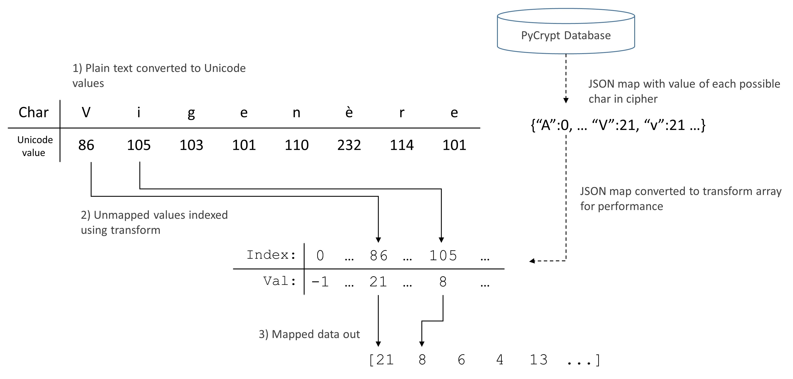

<h1>PyCrypt</h1>

<b>Note: Documentation is currently under construction</b>

PyCrypt is a high-speed package for applying arbitrary ciphers to
unicode text on a large scale. It grants the user freedom to write ciphers as
snippets of actual python code while preventing foul play through a robust, configurable
security system.    

The uncompromising nature of this package is best observed by viewing
[First-Time Use](#first) and then running
<code>speedTest.py</code>, where a Viginere cipher is applied to the entirety of <i>Moby-Dick</i> by Herman
Melville. On a  4-core 2700 Mhz laptop, encryption took <b>0.176 sec</b>.

<details open>

<summary>
    <h2 style="display:inline">Table of Contents</h3>
</summary>

1. [First-Time Use](#first)
2. [Quick Example](#example)
3. [Overview](#core)
    * [Character Mapping](#map)
    * [Cipher Formulas](#formula)
    * [Other Core Functions](#other)
4. [Database](#database)
5. [Security(WIP)](#security)

</details>

<h1>First-Time Use</h1><a name="example"></a>

The PyCrypt database is created the first time <code>PyCrypt.database</code> is imported or <code>PyCrypt.database.init()</code> is called. <br></br>
<b>The user will be asked for their PostgreSQL admin password. This password will only be used once and is never saved. See the function <code>init()</code> found within <code>database/__init__.py</code> for more information.</b>
<br></br>
All future transactions are then conducted through the generated user "pycrypt_default_user"; their privileges are defined in <code>database/initUser.SQL</code>.


<h1>Quick Example</h1><a name="example"></a>


The below code assumes that the map <i>alphaLower</i> and the cipher <i>vigenere</i> are
found within the PyCrpyt database. See [database](#database) on saving maps and
ciphers.

```python
from PyCrypt import *
import PyCrypt.database as database

plaintext = "Attack at dawn"
keyword = "lemon"
options = {"deleteTextOutsideMap": False, "cycleKeywordOutsideMap": False}

mapQuery = database.LoadMap("alphaLower")
cipherQuery = database.LoadCipher("vigenere")

transform, mapRange = DecompressTransform(mapQuery[3])
inverse, _ = DecompressInverse(mapQuery[4])

keys = ProcessKeys(transform, keyword)
numRepr = Click to expand/collapse (plaintext)

mappedText, maskedIndices = ApplyTransform(numRepr, transform)

encryptedText = ApplyFormula(cipherQuery[3], mappedText, keys, mapRange, maskedIndices, options=options)

cipherOut = ApplyTransform(encryptedText, inverse)[0]
cipherOut = Decode(cipherOut)
print(cipherOut)
```

<h1>Overview</h1><a name="core"></a>

The encryption process is broken into two distinct phases

- character mapping
- cipher application

<details open>

<summary>
    <h2 style="display:inline">Character Mapping</h2><a name="map"></a>
</summary>

The matter of converting a unicode string into an array of integers suitable
for large-scale operations is non-trivial and may yield different outcomes
depending on which assumptions are made by the user. For instance, do we assign
a value of zero to any character? Do we include punctuation? Do capital and
lower-case letters map to the same value? To remedy this, we give the user full
control over the process that transform unicode characters into an integer
array. A simplified overview of this process is given below (The actual
procedure also returns an array of unchanged/masked indices and also includes features to support masking specific subsections of plaintext).

<figure>
    
</figure>

<h3><b>DecompressTransform</b>(<i>transform</i>)<a name="DecompressTransform"></a></h3>

<DL>
    <DT><i>transform</i>
    <DD>The JSON <code>str</code>, typically loaded from PyCrypt's database, detailing which values any number of charaters map to
</DL>

Returns an <code>array[int]</code> through which
the mapping process is preformed and a <code>set</code> containing all possible values that may be returned by applying the transform

<h3><b>DecompressInverse</b>(<i>inverse</i>)<a name="DecompressInverse"></a></h3>

<DL>
    <DT><i>Inverse</i>
    <DD>The compressed JSON <code>str</code> detailing the  unicode values each <code>int</code> maps to. This is typically loaded from our database or generated through <code>GenInverseTransform()</code>.
</DL>

Returns an <code>array[int]</code> through which the mapping
process is undone and a <code>set</code> containing all possible values that may be returned by applying the inverse 

<h3><b>ApplyTransform</b>(<i>numRepr, transform, maskedIndices=None</i>)<a name="ApplyTransform"></a></h3>

<DL>
    <DT><i>numRepr</i>
    <DD>The <code>array[int]</code> of unicode values produced by <code>Encode()</code>
    <DT><i>transform</i>
    <DD>The <code>array[int]</code> (typically returned from either <code>DecompressTransform()</code> or <code>DecompressInverse()</code>) detailing what values a subset of unicode charters will map to
    <DT><i>maskedIndices</i>
    <DD> An <code>array[int]</code> containing the indices where the transform will not be applied
</DL>

Returns <code>array[int]</code> <i>transformedValues</i> and
<code>array[int]</code> <i>maskedIndices</i> containing the indices where the transform was not applied. These almost always correspond to characters outside of the transform such as spaces, punctuation, and accented characters

</details>

<details open>

<summary>
<h2 style="display:inline">Cipher Formulas</h2><a name="formula"></a>
</summary>

Formulas are composed of snippets of Python/Numpy code, subject to user-defined
restrictions. Before execution, the contents of the snippet is parsed using
abstract tree syntax. The use of banned attributes will
raise an exception during a security scan, as determined by a whitelist and a blacklist of permitted/banned functions/modules supplied by config.JSON.

The names <i>\_\_func_name\_\_</i> , <i>\_\_var_name\_\_</i> , and
<i>\_\_class_instance\_\_</i> are reserved and will raise exceptions if used
within the formula's text. The value of the local <i>out</i> is will be
returned after a formula's evaluation. The user is free to define functions,
lambdas,and local variables within a formula without triggering the security
system. Functionality for classes are currently a work in progress.

The locals <code>array[int]</code> <i>maskedIndices</i>, <code>array[int]</code>
<i>mappedIndices</i> and <code>array[int]</code>
<i>mapRange</i> are supplied to the formula during execution and
<i>numpy</i> is automatically imported as <i>np</i> at run time.
A <code>list[]</code> <i>keys</i> and <code>dict[str, object]</code> <i>options</i> contain  the parameters
a user may feed to formula during execution. In the example below,
<code>keys</code> contains a single value: the <code>array[int]</code>
of a
keyword. <i>Options</i> contain two:
<code>"cycleKeywordOutsideMap"</code> and <code>"deleteTextOutsideMap"</code>, and
the values of both are bools. 

```python
assert len(mapRange) == 1 + max(mapRange)

if options["cycleKeywordOutsideMap"]:
    offset = np.resize(keys[0], len(text))[mappedIndices]

else:
    offset = np.resize(keys[0], len(mappedIndices))

out = (text[mappedIndices] + offset) % len(mapRange)

if not options["deleteTextOutsideMap"]:
    out = np.put(text, mappedIndices, out)
```

<h3><b>ApplyFormula</b>(<i>formula, text, keys, mapRange, maskedIndices, options={}</i>)</h3>

<DL>
    <DT><i>formula</i>
    <DD>A <code>str</code> containing python code.
    <DT><i>text</i>
    <DD>The <code>array[int]</code> upon which <i>formula</i> is applied.
    <DT><i>keys</i>
    <DD> The <code>list[]</code> of keywords or key values passed to the formula at runtime. The elements within <i>keys</i> can be of any datatype.
    <DT><i>mapRange</i>
    <DD> The <code>array[int]</code> collection of all possible characters produced by <code>ApplyTransform</code> and the mapping process. This value is also returned from <code>database.LoadMap()</code>.
    <DT><i>maskedIndices</i>
    <DD> The <code>array[int]</code> containing the locations where the mapping process left characters unchanged, and will usually be equal to the second value returned from <code>ApplyTransform()</code>. When the formula is applied, the <code>array[int]</code> <i>mappedIndices</i> is set equal to the collection of indices not in <i>maskedIndices</i>. 
    <DT><i>options</i>
    <DD> The <code>dict[str, object]</code> containing the names and values of any additional variables needed by the formula at runtime.

</DL>

</details>

<details open>

<summary>
    <h2 style="display:inline">Other Core Functions</h2><a name="other"></a>
</summary>

<h3><b>CompressInverse</b>(<i>inverse</i>)</h3>

Preforms the inverse of <code>DecompressInverse()</code>, converting passed
<code>array[int]</code> into a JSON <code>str</code> more suitable for storage.
See [here](#DecompressInverse) for details on <code>DecompressInverse()</code>.

<h3><b>CompressTransform</b>(<i>transform</i>)</h3>

Preforms the inverse of <code>DecompressTransform()</code>, converting passed
<code>array[int]</code> into a JSON <code>str</code> more suitable for storage.
See [here](#DecompressTransform) for details on <code>DecompressTransform()</code>.

<h3><b>Decode</b>(<i>numRep</i>)</h3>

Converts passed <code>array[int]</code> to a <code>str</code> using the UTF-32
encoding scheme.

<h3><b>Encode</b>(<i>plaintext</i>)</h3>

Converts passed <code>str</code> to an <code>array[int]</code> containing the
UTF-32 values of each character in <i>plaintext</i>

<h3><b>ProcessKeys</b>(<i>transform, *keys</i>)</h3>

Applies <code>array[int]</code> <i>transform</i> without a mask to each <code>str</code> in
<code>list[object]</code> <i>keys</i>, then returns the contents of <i>keys</i>.
See [here](#ApplyTransform) for details on <code>ApplyTransform()</code>. 

</details>

<details open>

<summary>
    <h1 style="display:inline">Database</h1><a name="database"></a>
</summary>

<h3><b>database.Init()</b></h3>

This function is automatically called when importing <code>database</code> and is
responsible for establishing a connection to PyCrypt. If the
necessary database or user does not exist, they will be created.

<h3><b>database.con</b></h3>

The <code>pg8000.native.Connection</code> object created by calling
<code>database.Init()</code>. This is used to interact with the PyCrypt
Database. See [pg8000 documentaion](https://github.com/tlocke/pg8000) for more
information.


<h3><b>database.SaveMap</b>(<i>name, transform, inverse, keywords</i>)</h3>

<DL>
    <DT><i>name</i>
    <DD>The <code>str</code> name of the cipher to be added to the database. Will raise an exception the passed name is already taken.
    <DT><i>transfom</i>
    <DD>A <code>dict[str, int]</code> defining what value each unicode character maps to.
    <DT><i>inverse</i>
    <DD> A <code>dict[int, int]</code> used to reverse the mapping process. if inverse is <code>None</code>, then one will be generated.
    <DT><i>keywords</i>
    <DD>A <code>list[str]</code> containing keywords that can users can by once the passed cipher is added to database.
</DL>


```python
# NOTE: This only runs if a map with the name "alphaLower" is not already in the system
if len(database.con.run("""SELECT 1 FROM maps WHERE "name"='alphaLower'""")) == 0:
    transform = {
        "A":0,  "a":0,  "B":1,  "b":1,  "C":2,  "c":2,  "D":3,  "d":3,  "E":4,  "e":4,
        "F":5,  "f":5,  "G":6,  "g":6,  "H":7,  "h":7,  "I":8,  "i":8,  "J":9,  "j":9,
        "K":10, "k":10, "L":11, "l":11, "M":12, "m":12, "N":13, "n":13, "O":14, "o":14,
        "P":15, "p":15, "Q":16, "q":16, "R":17, "r":17, "S":18, "s":18, "T":19, "t":19,
        "U":20, "u":20, "V":21, "v":21, "W":22, "w":22, "X":23, "x":23, "Y":24, "y":24,
        "Z":25, "z":25}

    t = DecompressTransform(transform)[0]
    i = GenInverseTransform(t)

    inverse = CompressInverse(i)

    keywords = ["alpha", "lower", "ascii", "alphabet"]

    database.SaveMap("alphaLower", transform, inverse, keywords)
```


<h3><b>database.LoadMap</b>(<i>identifier</i>)</h3>

<DL>
    <DT><i>identifier</i>
    <DD>This can be either a <code>str</code> or an <code>int</code>. If identifier is an integer, <code>database.LoadMap( )</code> will return the map with that ID. Otherwise, it will return all maps whose name matches the passed identifier.
</DL>

[//]: # (TODO: add type hints to list)
Returns a list of entries matching the identifier. Each entry will contain 6 items, in order:

0. A unique integer ID
1. A hash formed from user data and the contents of the map
2. A string name
3. A compressed JSON transform used to map characters to ints
4. The compressed inverse transform used convert ints back to characters
5. A list of keywords (primarily for use within database)

```python
query  = database.LoadMap("alphaLower")
print(f"Hash of alphaLower map: '{query[1]}'")
```
<h3><b>database.SaveCipher</b>(<i>name, formula, inverse, keywords, options</i>)</h3>

<DL>
    <DT><i>name</i>
    <DD>The <code>str</code> name of the cipher to be added to the database. Will raise an exception the passed name is already taken.
    <DT><i>formula</i>
    <DD>A <code>str</code> consisting of valid python code that transforms a mapped plaintext array into cypher text. 
    <DT><i>inverse</i>
    <DD> A <code>str</code> containing Python code that transforms cypher text into plaintext. The rules for the <i>formula</i> parameter apply.
    <DT><i>keywords</i>
    <DD>A <code>list[]</code> containing keywords that can be sorted by once cipher is added to database.
    <DT><i>options</i>
    <DD>A <code>dict[str, object]</code> in which each key/value pair represents the name and default value of extra locals passed to cipher/inverse. 
</DL>

Security checks are automatically preformed whenever this function is called.
Exceptions will be raised if any check fails.     

```python
# NOTE: This only runs if a vigenere cipher is not aready in the system
if len(database.con.run("""SELECT 1 FROM ciphers WHERE "name"='vigenere'""")) == 0:

    keywords = ["vigenere","caesar","polyalphabetic"]
    options = {"cycleKeywordOutsideMap":False, "deleteTextOutsideMap":True}

    formulaStr = """
    assert len(mapRange) == 1 + max(mapRange)

    if options["cycleKeywordOutsideMap"]:
        offset = np.resize(keys[0], len(text))[mappedIndices]

    else:
        offset = np.resize(keys[0], len(mappedIndices))

    out = (text[mappedIndices] + offset) % len(mapRange)

    if not options["deleteTextOutsideMap"]:
        out = np.put(text, mappedIndices, out)
    """

    inverseStr = """
    assert len(mapRange) == 1 + max(mapRange)

    if options["cycleKeywordOutsideMap"]:
        offset = np.resize(keys[0], len(text))[mappedIndices]
    else:
        offset = np.resize(keys[0], len(mappedIndices))

    if options["deleteTextOutsideMap"]:
        out = (text - offset) % len(mapRange)
    else:
        out = (text[mappedIndices] - offset) % len(mapRange)
        out = np.put(text, mappedIndices, out)
    """

    database.SaveCipher("vigenere", formulaStr, inverseStr, keywords, options)
```

<h2><b>database.LoadCipher</b>(<i>identifier</i>)</h2>

<DL>
<DT><i>identifier</i>
<DD>This can be either a <code>str</code> or an <code>int</code>. If identifier is an integer, <code>database.LoadCipher()</code> will return the cipher with that ID. Otherwise, it will return all ciphers whose name matches the passed identifier.
</DL>

[//]: # (TODO: add type hints to list)
Returns a list of entries matching the identifier. Each entry will contain 7 items, in order:

0. A unique integer ID
1. A hash formed from user data and the contents of the map
2. A string name
3. The formula text used for encryption
4. The inverse formula used for decryption
5. A list of keywords (primarily for use within database)
6. A dict whose keys are the names of parameters used in the formula/inverse and
whose values are those parameters' default values.

```python
query  = database.LoadCipher("vigenere")
print(f"Hash of vigenere cipher: '{query[1]}'")
```

</details>

