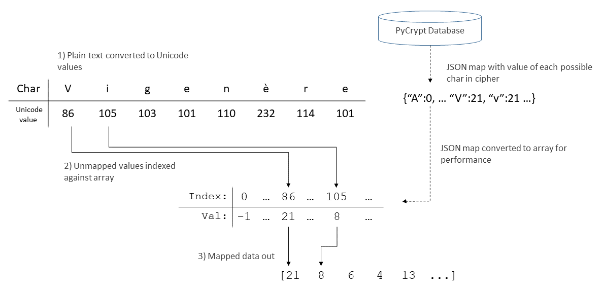

<h1>PyCrypt</h1>

Note: Documentation is currently under construction

<h3>Table of Contents</h3>


1. [Example Use](#example)
2. [Overview](#core)
3. [Database](#database)
4. [Security (WIP)](#security)

<h1>Example Use</h1><a name="example"></a>

The below code assumes that the map `alphaLower` and the cipher `vigenere` are
found within the PyCrpyt database. See [database](#database) on saving maps and
ciphers.

```python
from PyCrypt import *
import PyCrypt.database as database

plaintext = "Attack at dawn"
keyword = "lemon"
options = {"deleteTextOutsideMap": False, "cycleKeywordOutsideMap": False}

mapQuery = database.LoadMap("alphaLower")
cipherQuery = database.LoadCipher("vigenere")

transform, mapRange = DecompressTransform(mapQuery[3])
inverse, _ = DecompressInverse(mapQuery[4])

keys = ProcessKeys(transform, keyword)
numRepr = Encode(plaintext)

mappedText, maskedIndices = ApplyTransform(numRepr, transform)

encryptedText = ApplyFormula(cipherQuery[3], mappedText, keys, mapRange, maskedIndices, options=options)

cipherOut = ApplyTransform(encryptedText, inverse)[0]
cipherOut = Decode(cipherOut)
print(cipherOut)
```
<h1>Overview</h1><a name="core"></a>

The encryption process is broken into two distinct phases

- character mapping
- cipher application

<h2>Character Mapping </h2>

The matter of converting a unicode string into an array of integers suitable
for large-scale operations is non-trivial and may yield different outcomes
depending on which assumptions are made by the user. For instance, do we assign
a value of zero to any character? Do we include punctuation? Do capital and
lower-case letters map to the same value? To remedy this, we give the user full
freedom to determine the value assigned to each unicode character. A simplified overview of this process is given below

<figure>
    
    <figcaption> Terrible low-rez image will be replaced with a better one at a later date </figcaption>
</figure>

<h3><b>DecompressTransform</b>(<i>transform</i>)</h3>
Returns two items: a decompressed array through which the mapping process is preformed, and a set detailing all possible values that a character within the transform may map to.
<DL>
    <DT><i>transform</i>
    <DD>The JSON string (typically loaded from our database) detailing values any number of charaters map to
    <DT>
</DL>

<h3><b>DecompressInverse</b>(<i>inverse</i>)</h3>
Returns two items: a decompressed array through which the mapping process is undone, and a set detailing all possible values that a integer within the inverse may map to.
<DL>
    <DT><i>inverse</i>
    <DD>The JSON string (typically loaded from our database) detailing the decimal values of the unicode values a set of values may map to
    <DT>
</DL>

<h3><b>ApplyTransform</b>(<i>numRepr, transform, maskedIndices=None</i>)</h3>
<DL>
    <DT><i>numRepr</i>
    <DD>The JSON string (typically loaded from our database) detailing the decimal values of the unicode values a set of values may map to
    <DT>
    <DT><i>transform</i>
    <DD>The JSON string (typically loaded from our database) detailing the decimal values of the unicode values a set of values may map to
    <DT><i>maskedIndices</i>
    <DD> Sample Text
</DL>

<h2>Cipher Formulas</h2>

Formulas are composed of snippets of Python/Numpy code, subject to user-defined
restrictions. Before execution, the contents of the snippet is parsed using
abstract tree syntax. A whitelist and blacklist of permitted/banned functions
and modules are supplied by config.JSON, and the use of banned attribitues will
raise an exception during the security scan.

The names <code>__func_name__</code> , <code>__var_name__</code> , and
<code>__class_instance__</code> are reserved and will raise exceptions if used
within the formula's text. The value of the local <code>out</code> is will be
returned after a formula's evaluation. The user is free to define functions,
lambdas,and local variables within a formula without triggering the security
system. Functionality for classes are currently a work in progress.

The locals <code>maskedIndices</code>, <code>mappedIndices</code> and
<code>mapRange</code> are supplied to the formula during execution and
<code>numpy</code> is automatically imported as <code>np</code> at run time.
A list <code>keys</code> and dict <code>options</code> contain  the parameters
a user may feed to formula during execution. In the example below,
<code>keys</code> contains one value: an array corresponding to a passed
keyword, and <code>options</code> contains two entries:
<code>"cycleKeywordOutsideMap"</code> and <code>"deleteTextOutsideMap"</code>,
both of which are bools. 


```python
assert len(mapRange) == 1 + max(mapRange)

if options["cycleKeywordOutsideMap"]:
    offset = np.resize(keys[0], len(text))[mappedIndices]

else:
    offset = np.resize(keys[0], len(mappedIndices))

out = (text[mappedIndices] + offset) % len(mapRange)

if not options["deleteTextOutsideMap"]:
    out = np.put(text, mappedIndices, out)
```

<h1>Database</h1><a name="database"></a>

<h3><b>database.Init()</b></h3>

This function is automatically called when importing <code>database</code> and is
responsible for establishing a connection to PyCrypt. If the
necessary database or user does not exist, they will be created.

<h3><b>database.con</b></h3>

The <code>pg8000.native.Connection</code> object created by calling
<code>database.Init()</code>. This is used to interact with the PyCrypt
Database. See [pg8000 documentaion](https://github.com/tlocke/pg8000) for more
information.


<h3><b>database.SaveMap</b>(<i>name, transform, inverse, keywords</i>)</h3>

<DL>
    <DT><i>name</i>
    <DD>The name of the cipher to be added to the database. Will raise an exception the passed name is already taken.
    <DT><i>transfom</i>
    <DD>A <code>dict[str, int]</code> defining what value each unicode character maps to.
    <DT><i>inverse</i>
    <DD> A <code>dict[int, int]</code> used to reverse the mapping process. if inverse is <code>None</code>, then one will be generated.
    <DT><i>keywords</i>
    <DD>A <code>list[str]</code> containing keywords that can users can by once the passed cipher is added to database.
</DL>


```python
# NOTE: This only runs if a map with the name "alphaLower" is not already in the system
if len(database.con.run("""SELECT 1 FROM maps WHERE "name"='alphaLower'""")) == 0:
    transform = {
        "A":0,  "a":0,  "B":1,  "b":1,  "C":2,  "c":2,  "D":3,  "d":3,  "E":4,  "e":4,
        "F":5,  "f":5,  "G":6,  "g":6,  "H":7,  "h":7,  "I":8,  "i":8,  "J":9,  "j":9,
        "K":10, "k":10, "L":11, "l":11, "M":12, "m":12, "N":13, "n":13, "O":14, "o":14,
        "P":15, "p":15, "Q":16, "q":16, "R":17, "r":17, "S":18, "s":18, "T":19, "t":19,
        "U":20, "u":20, "V":21, "v":21, "W":22, "w":22, "X":23, "x":23, "Y":24, "y":24,
        "Z":25, "z":25}

    t = DecompressTransform(transform)[0]
    i = GenInverseTransform(t)

    inverse = CompressInverse(i)

    keywords = ["alpha", "lower", "ascii", "alphabet"]

    database.SaveMap("alphaLower", transform, inverse, keywords)
```
<br></br>

<h3><b>database.LoadMap</b>(<i>identifier</i>)</h3>

<DL>
    <DT><i>identifier</i>
    <DD>This can be either a sting or an int. If identifier is an integer, <code>database.LoadMap( )</code> will return the map with that ID. Otherwise, it will return all maps whose name matches the passed identifier.
</DL>

```python
query  = database.LoadMap("alphaLower")
print(f"Hash of alphaLower map: '{query[1]}'")
```
<br></br>
<h3><b>database.SaveCipher</b>(<i>name, formula, inverse, keywords, options</i>)</h3>

<DL>
    <DT><i>name</i>
    <DD>The name of the cipher to be added to the database. Will raise an exception the passed name is already taken.
    <DT><i>formula</i>
    <DD>A string consisting of valid python code that transforms a mapped plaintext array into cypher text. 
    <DT><i>inverse</i>
    <DD>Python code that transforms cypher text into plaintext. The rules for the <code>formula</code> parameter apply.
    <DT><i>keywords</i>
    <DD>A list containing keywords that can be sorted by once cipher is added to database.
    <DT><i>options</i>
    <DD>A dictionary in which each key/value pair represents the name and default value of extra locals passed to cipher/inverse. 
</DL>

Security checks are automatically preformed whenever this function is called.
Notably, exceptions will be raised if any security check fails.     

```python
# NOTE: This only runs if a vigenere cipher is not aready in the system
if len(database.con.run("""SELECT 1 FROM ciphers WHERE "name"='vigenere'""")) == 0:

    keywords = ["vigenere","caesar","polyalphabetic"]
    options = {"cycleKeywordOutsideMap":False, "deleteTextOutsideMap":True}

    formulaStr = """
    assert len(mapRange) == 1 + max(mapRange)

    if options["cycleKeywordOutsideMap"]:
        offset = np.resize(keys[0], len(text))[mappedIndices]

    else:
        offset = np.resize(keys[0], len(mappedIndices))

    out = (text[mappedIndices] + offset) % len(mapRange)

    if not options["deleteTextOutsideMap"]:
        out = np.put(text, mappedIndices, out)
    """

    inverseStr = """
    assert len(mapRange) == 1 + max(mapRange)

    if options["cycleKeywordOutsideMap"]:
        offset = np.resize(keys[0], len(text))[mappedIndices]
    else:
        offset = np.resize(keys[0], len(mappedIndices))

    if options["deleteTextOutsideMap"]:
        out = (text - offset) % len(mapRange)
    else:
        out = (text[mappedIndices] - offset) % len(mapRange)
        out = np.put(text, mappedIndices, out)
    """

    database.SaveCipher("vigenere", formulaStr, inverseStr, keywords, options)
```


